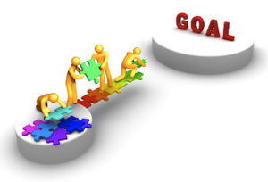

# Technical Design Document
I am Pol Recasens, student of the [Bachelor’s Degree in
Video Games by UPC at CITM](https://www.citm.upc.edu/ing/estudis/graus-videojocs/). This content is generated for the second year’s
subject Project 2, under supervision of lecturer [Ricard Pillosu](https://es.linkedin.com/in/ricardpillosu).

# WHAT IS IT?

- Is a document made by a seasoned programmer, preferably the technical director or a lead programmer.

- Is part of the preproduction phase of a video game development.

- It specifies the technical resources that will be used.

- Set up the experimental features.

# WHY IS IT IMPORTANT?

- Reduces wasted efforts and confusion.

- It helps the team make their decisions.

- Make the reviewers optimistic about the game's chance of succeeding(the project is under control).

# WHAT DOES IT CONTAINS?

There are a lot of Technical Design Documents. Therefore, there's not one unique way to make it.
But, there are some sections that always appear.

- Introduction

- Technical goals

- Technical risks

- Development overview
    
- Estimated schedule

- Code style guidelines

- Code architecture

- Graphics(player screen)

- Audio(format)

## Introduction

- Include a game summary. Just a few lines.
- Target platform. It must be mentioned to which platform the game is directed.

## Technical goals

- It includes experimental features like unproven technologies and techniques or unique ideas.
- Don't include features that have been aleady proven by existing games, even if they are new to the development team.
- Experimental features generally need more time in the schedule.
- This experiments are seen as worthwhile investments to create a good renown in the future

## Technical risks

- Aspect of development that will cause a set back if they fail.
- If you don't foresee any technical risks, by all means say so.
- List technologies that, even though they function, your company has never developed or has little experience with them.
- Every risk must have a solution.
- It creates a comfort level because it makes the impression that the project is under control.

## Development overview
### Development team
- People in charge of development and their tasks

## Development environment
- Everything the company needs to develop the game, such as infrastructure modifications to ensure that the project can be carried out.

### Development Hardware
   - List of all hardware that the company will use(if the company has already them or they need to buy)
    
 
    
### Development Software
   - List of all software that the company will use (licenses, etc.)
    

### External code
   - External libraries and software(Brofiller, SDL, STL...)

## Estimated schedule
- Overall duration of the development cycle.
- It contains the estimation of: milestones, alpha, beta and gold master.

## Code style guidelines
- A code regulation will avoid confusions when programming.
- Creates a great organization.
- Here is an example of code style guidelines that are important in our case
    - Naming conventions
    - Variables
    - Loops
    - Conditionals
    - Classes and structs
    - XML
    
    

## Code architecture
- It provides a wide vision of the structure of the code
- It helps to understand the structure
- Utilization of the UML

## Graphics
- Make sure the game has the correct dimensions, otherwise the game won't look good
- Resolution of the platform screen(pc screen, smart phone,etc)
- Size of the tiles
- Texture loading(XML)

## Audio
- It includes the audio format(.wav, .ogg, MP3...)
- Most destacable features(audio 2D, audio 3D, control over volume,etc)

